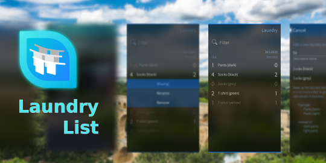

<!--
SPDX-FileCopyrightText: 2018-2023 Mirian Margiani
SPDX-License-Identifier: GFDL-1.3-or-later
-->

# Laundry List for Sailfish OS

Laundry List is a simple app to keep track of your laundry.

## Why this app?

This app fills a very specific niche.

If you live in an apartment building that has shared washing machines and a
common drying room for everyone, then this app may be for you. If sometimes
laundry happens to mysteriously disappear from these places, then this app helps
you keep track of questions like “How many items have I washed?” and “How many
pieces did I already fetch from the dryer?”.

## Other uses

This app can be used for different purposes.

Apart from its original use-case, this app proved to be quite useful as a
grocery list. I am currently planning a new version for shopping with mostly
cosmetic changes.

## Help and support

You are welcome to [leave a comment in the forum](https://forum.sailfishos.org/t/apps-by-ichthyosaurus/15753)
if you have any questions or ideas.

## Translations

It would be wonderful if the app could be translated in as many languages as possible!

Translations are managed using
[Weblate](https://hosted.weblate.org/projects/harbour-laundry/translations).
Please prefer this over pull request (which are still welcome, of course).
If you just found a minor problem, you can also
[leave a comment in the forum](https://forum.sailfishos.org/t/apps-by-ichthyosaurus/15753)
or open an issue.

Please include the following details:

1. the language you were using
2. where you found the error
3. the incorrect text
4. the correct translation

### Manually updating translations

Please prefer using
[Weblate](https://hosted.weblate.org/projects/harbour-laundry) over this.
You can follow these steps to manually add or update a translation:

1. *If it did not exists before*, create a new catalog for your language by copying the
   base file [translations/harbour-laundry.ts](translations/harbour-laundry.ts).
   Then add the new translation to [harbour-laundry.pro](harbour-laundry.pro).
2. Add yourself to the list of contributors in [qml/pages/AboutPage.qml](qml/pages/AboutPage.qml).
3. (optional) Translate the app's name in [harbour-laundry.desktop](harbour-laundry.desktop)
   if there is a (short) native term for it in your language.

See [the Qt documentation](https://doc.qt.io/qt-5/qml-qtqml-date.html#details) for
details on how to translate date formats to your *local* format.

## Building and contributing

*Bug reports, and contributions for translations, bug fixes, or new features are always welcome!*

1. Clone the repository by running `git clone --recurse-submodules https://github.com/ichthyosaurus/harbour-laundry.git`
2. Apply necessary patches: `git apply libs/*.patch`
2. Open `harbour-laundry.pro` in Sailfish OS IDE (Qt Creator for Sailfish)
3. To run on emulator, select the `i486` target and press the run button
4. To build for the device, select the `armv7hl` target and click “deploy all”;
   the RPM packages will be in the `RPMS` folder

If you contribute, please do not forget to add yourself to the list of
contributors in [qml/pages/AboutPage.qml](qml/pages/AboutPage.qml)!

## Donations and contributions

If you want to support my work, I am always happy if you buy me a cup of coffee
through [Liberapay](https://liberapay.com/ichthyosaurus).

Of course it would be much appreciated as well if you support this project by
contributing to translations or code! See above how you can contribute 🎕.

## License

> Copyright (C) 2023  Mirian Margiani

Laundry List is Free Software released under the terms of the
[GNU General Public License v3 (or later)](https://spdx.org/licenses/GPL-3.0-or-later.html).
The source code is available [on Github](https://github.com/ichthyosaurus/harbour-laundry).
All documentation is released under the terms of the
[GNU Free Documentation License v1.3 (or later)](https://spdx.org/licenses/GFDL-1.3-or-later.html).

This project follows the [REUSE specification](https://api.reuse.software/info/github.com/ichthyosaurus/harbour-laundry).
